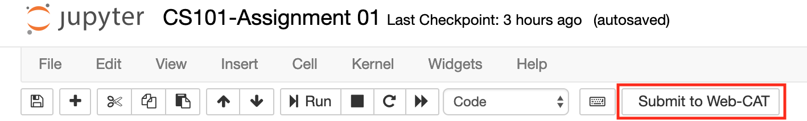
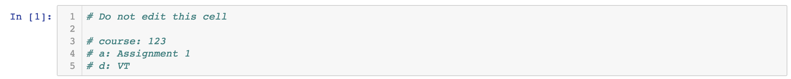
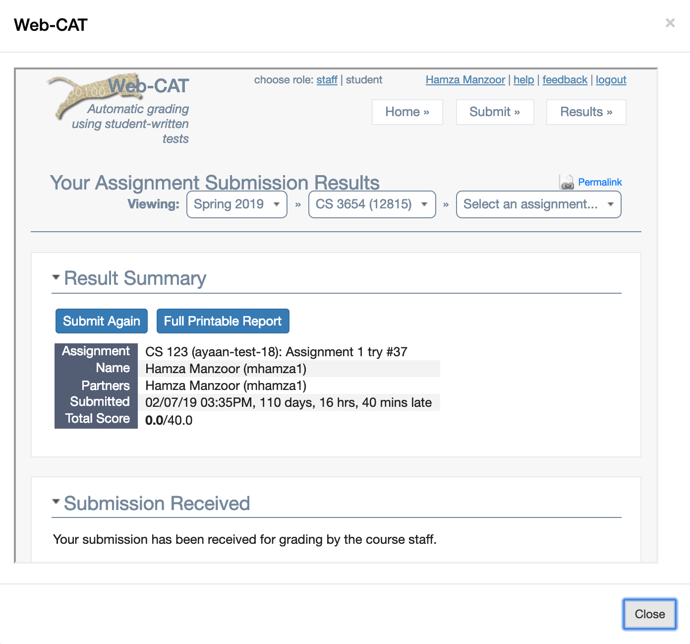

# webcatjupyterplugin
A Jupyter Notebook extension for submitting notebook files to Web-CAT.

# Requirements

1. Python 3
2. pip
3. Jupyter Notebook

# Directions

## Linux / macOS

##### With Anaconda:
Follow these steps if you are running Jupyter Notebooks through Anaconda:

1. conda install git pip
2. pip install git+https://github.com/CSSPLICE/webcatjupyterplugin
3. jupyter serverextension enable --py webcatjupyterplugin
4. jupyter nbextension install --py webcatjupyterplugin
5. jupyter nbextension enable --py webcatjupyterplugin
    
##### With pip:

If you are not using Anaconda, use the following commands:

1. pip3 install git+https://github.com/CSSPLICE/webcatjupyterplugin
2. jupyter serverextension enable --py webcatjupyterplugin
3. jupyter nbextension install --py webcatjupyterplugin
4. jupyter nbextension enable --py webcatjupyterplugin

## Windows

If you have Windows operating system, follow these steps:

1. Install Anaconda
2. Open Anaconda Prompt and run these commands:
3. conda install git pip
4. pip install git+https://github.com/CSSPLICE/webcatjupyterplugin
5. jupyter serverextension enable --py webcatjupyterplugin
6. jupyter nbextension install --py webcatjupyterplugin
7. jupyter nbextension enable --py webcatjupyterplugin

# Assignment Indentification

The Web-CAT assignment indetification parameters are fetched from the first cell. Paste the following comments in the first cell and change the values with your assignment parameters.

    # Do not edit this cell

    # course: 123
    # a: Assignment 1
    # d: VT

# Screenshots

#### Submit to Web-CAT button

#### Web-CAT Assignment Parameters

#### Assignment Submission

